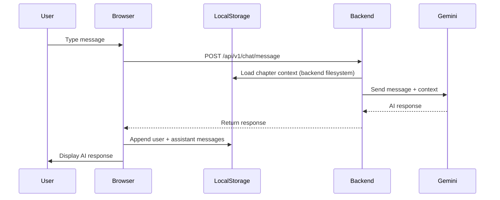
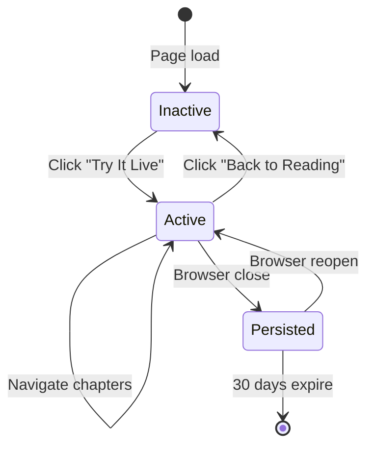

# Data Model: Interactive Agentic Learning Interface

**Feature**: 001-agentic-interface
**Date**: 2025-11-05
**Phase**: Phase 1 - Data Model Design

## Overview

This document defines all data structures, schemas, and relationships for the agentic interface. Since this is a browser-first architecture with no backend database, most data lives in:
- **Browser LocalStorage** (chat history, session state)
- **Backend Memory** (transient chapter context cache)
- **API Payloads** (request/response contracts)

---

## Core Entities

### 1. User Session

**Purpose**: Track a user's active agentic interface session

**Storage**: Browser memory (React state) + LocalStorage (persistence)

**TypeScript Schema**:
```typescript
interface UserSession {
  sessionId: string;              // UUID v4, generated on first activation
  chapterId: string;              // Current chapter ID (e.g., "01-ai-development-revolution")
  isActive: boolean;              // Is agentic interface currently visible?
  createdAt: Date;                // When session started
  lastActivityAt: Date;           // Last user interaction timestamp
}
```

**LocalStorage Key**: `agentic-session-meta`

**Example**:
```json
{
  "sessionId": "a3f5b9c8-4d2e-4f1a-9b3c-7e8d6f5a4b3c",
  "chapterId": "13-type-hints-and-annotations",
  "isActive": true,
  "createdAt": "2025-11-05T14:30:00Z",
  "lastActivityAt": "2025-11-05T15:45:23Z"
}
```

**Lifecycle**:
1. **Creation**: When user clicks "Try It Live" button
2. **Updates**: On chapter navigation, chat activity
3. **Persistence**: Saved to localStorage on every state change
4. **Cleanup**: Delete sessions older than 30 days (future enhancement)

---

### 2. Chat Message

**Purpose**: Individual message in conversation between user and AI

**Storage**: Browser LocalStorage (per chapter)

**TypeScript Schema**:
```typescript
interface ChatMessage {
  id: string;                     // Message ID (timestamp-based for ordering)
  sessionId: string;              // Links to UserSession
  role: 'user' | 'assistant';     // Who sent the message
  content: string;                // Message text (markdown supported)
  timestamp: Date;                // When message was sent
  chapterId?: string;             // Chapter context (redundant but useful for queries)
  metadata?: {
    tokenCount?: number;          // Tokens used (for monitoring)
    latency?: number;             // Response time in ms
    error?: string;               // Error message if failed
  };
}
```

**LocalStorage Key Pattern**: `agentic-chat-{chapterId}`

**Example**:
```json
{
  "id": "1730818800000-1",
  "sessionId": "a3f5b9c8-4d2e-4f1a-9b3c-7e8d6f5a4b3c",
  "role": "user",
  "content": "I don't understand why type hints are useful",
  "timestamp": "2025-11-05T15:30:00Z",
  "chapterId": "13-type-hints-and-annotations",
  "metadata": {}
}
```

```json
{
  "id": "1730818803000-2",
  "sessionId": "a3f5b9c8-4d2e-4f1a-9b3c-7e8d6f5a4b3c",
  "role": "assistant",
  "content": "Type hints in Python 3.13+ help with:\n1. Code readability...",
  "timestamp": "2025-11-05T15:30:03Z",
  "chapterId": "13-type-hints-and-annotations",
  "metadata": {
    "tokenCount": 1250,
    "latency": 2300
  }
}
```

**Chat History Structure** (LocalStorage value):
```json
[
  { "id": "...", "role": "user", "content": "...", ... },
  { "id": "...", "role": "assistant", "content": "...", ... },
  { "id": "...", "role": "user", "content": "...", ... }
]
```

**Operations**:
```typescript
// Load chat history for current chapter
const loadChatHistory = (chapterId: string): ChatMessage[] => {
  const key = `agentic-chat-${chapterId}`;
  const data = localStorage.getItem(key);
  return data ? JSON.parse(data) : [];
};

// Append new message
const appendMessage = (chapterId: string, message: ChatMessage) => {
  const history = loadChatHistory(chapterId);
  history.push(message);
  localStorage.setItem(`agentic-chat-${chapterId}`, JSON.stringify(history));
};

// Clear chat history for chapter
const clearChatHistory = (chapterId: string) => {
  localStorage.removeItem(`agentic-chat-${chapterId}`);
};
```

---

### 3. Canvas Diagram

**Purpose**: Mermaid diagram rendered in canvas panel

**Storage**: Transient (React state), optionally persisted in message metadata

**TypeScript Schema**:
```typescript
interface CanvasDiagram {
  id: string;                     // Diagram ID (timestamp or message ID)
  mermaidSyntax: string;          // Raw Mermaid code
  rendered: boolean;              // Has it been successfully rendered?
  error?: string;                 // Rendering error if any
  zoomLevel: number;              // Current zoom (default 1.0)
  panOffset: { x: number; y: number }; // Pan position
  createdAt: Date;                // When diagram was generated
  linkedMessageId?: string;       // Chat message that generated this diagram
}
```

**Example**:
```json
{
  "id": "diagram-1730818803",
  "mermaidSyntax": "graph TD\n  A[Type Hints] --> B[IDE Support]\n  A --> C[Error Prevention]\n  A --> D[Documentation]",
  "rendered": true,
  "zoomLevel": 1.2,
  "panOffset": { "x": 0, "y": 0 },
  "createdAt": "2025-11-05T15:30:05Z",
  "linkedMessageId": "1730818803000-2"
}
```

**State Management**:
```typescript
// React state (not persisted to localStorage in MVP)
const [activeDiagram, setActiveDiagram] = useState<CanvasDiagram | null>(null);

// Extract Mermaid from AI response
const extractMermaid = (content: string): string | null => {
  const match = content.match(/```mermaid\n([\s\S]*?)```/);
  return match ? match[1].trim() : null;
};

// Auto-render when AI generates Mermaid
useEffect(() => {
  if (latestMessage.role === 'assistant') {
    const mermaid = extractMermaid(latestMessage.content);
    if (mermaid) {
      setActiveDiagram({
        id: `diagram-${Date.now()}`,
        mermaidSyntax: mermaid,
        rendered: false,
        zoomLevel: 1.0,
        panOffset: { x: 0, y: 0 },
        createdAt: new Date(),
        linkedMessageId: latestMessage.id
      });
    }
  }
}, [latestMessage]);
```

**Future Enhancement**: Store diagram history in localStorage for navigation

---

### 4. Chapter Context

**Purpose**: Full content of a chapter used as AI context

**Storage**: Backend memory (ephemeral, loaded from filesystem on demand)

**Python Schema**:
```python
from pydantic import BaseModel

class ChapterContext(BaseModel):
    chapter_id: str              # Chapter identifier
    content: str                 # Full markdown content (headings, text, code)
    length: int                  # Character count
    retrieved_at: datetime       # Cache timestamp
    source_files: list[str]      # Paths to source markdown files
```

**Example**:
```python
{
  "chapter_id": "13-type-hints-and-annotations",
  "content": "# Type Hints and Annotations\n\nPython 3.13 introduces...",
  "length": 45230,
  "retrieved_at": "2025-11-05T15:29:58Z",
  "source_files": [
    "book-source/docs/Part-04-Python-Fundamentals/13-type-hints/intro.md"
  ]
}
```

**Backend Caching** (optional, for performance):
```python
from functools import lru_cache

@lru_cache(maxsize=50)  # Cache up to 50 chapters
async def get_chapter_context_cached(chapter_id: str) -> str:
    return await get_chapter_context(chapter_id)
```

**Content Processing**:
1. Read all `.md` files in chapter directory
2. Remove frontmatter (YAML between `---`)
3. Remove code blocks (keep explanatory text only, avoid token bloat)
4. Truncate to 50k characters if needed
5. Return as plain text string

---

## API Request/Response Models

### 1. Chat Message Request

**Endpoint**: `POST /api/v1/chat/message`

**Pydantic Model**:
```python
class ChatMessageRequest(BaseModel):
    message: str                 # User's question
    chapter_id: Optional[str]    # Current chapter (for context)
    session_id: Optional[str]    # Session tracking
```

**Example**:
```json
{
  "message": "Explain how type hints work with lists",
  "chapter_id": "13-type-hints-and-annotations",
  "session_id": "a3f5b9c8-4d2e-4f1a-9b3c-7e8d6f5a4b3c"
}
```

**Validation**:
- `message`: Required, min 1 char, max 2000 chars
- `chapter_id`: Optional, matches pattern `\d{2}-[a-z-]+`
- `session_id`: Optional, UUID format

---

### 2. Chat Message Response

**Pydantic Model**:
```python
class ChatMessageResponse(BaseModel):
    response: str                # AI's answer
    session_id: str              # Session tracking (returned for client)
    metadata: Optional[dict]     # Token count, latency, etc.
```

**Example**:
```json
{
  "response": "Type hints with lists use `list[type]` syntax in Python 3.13+:\n\n```python\nnumbers: list[int] = [1, 2, 3]\n```\n\nThis tells type checkers that `numbers` contains integers.",
  "session_id": "a3f5b9c8-4d2e-4f1a-9b3c-7e8d6f5a4b3c",
  "metadata": {
    "tokens_used": 1150,
    "latency_ms": 2340,
    "model": "gemini-2.5-flash"
  }
}
```

---

### 3. Session Init Request

**Endpoint**: `POST /api/v1/chat/init`

**Pydantic Model**:
```python
class SessionInitRequest(BaseModel):
    chapter_id: Optional[str]    # Chapter context for welcome message
```

**Example**:
```json
{
  "chapter_id": "13-type-hints-and-annotations"
}
```

---

### 4. Session Init Response

**Pydantic Model**:
```python
class SessionInitResponse(BaseModel):
    session_id: str              # Generated UUID
    welcome_message: str         # Contextual greeting
```

**Example**:
```json
{
  "session_id": "a3f5b9c8-4d2e-4f1a-9b3c-7e8d6f5a4b3c",
  "welcome_message": "Welcome! I'm here to help you understand type hints and annotations in Python 3.13+. What would you like to know?"
}
```

---

### 5. Error Response (All Endpoints)

**Pydantic Model**:
```python
class ErrorResponse(BaseModel):
    detail: str                  # Human-readable error message
    code: str                    # Error code (e.g., "CHAPTER_NOT_FOUND")
    timestamp: datetime          # When error occurred
```

**Example**:
```json
{
  "detail": "Chapter '99-nonexistent' not found",
  "code": "CHAPTER_NOT_FOUND",
  "timestamp": "2025-11-05T15:30:10Z"
}
```

**HTTP Status Codes**:
- `200 OK`: Success
- `400 Bad Request`: Invalid input (validation error)
- `404 Not Found`: Chapter not found
- `429 Too Many Requests`: Rate limit exceeded
- `500 Internal Server Error`: Server/API failure
- `503 Service Unavailable`: Gemini API down

---

## LocalStorage Schema Summary

| Key | Type | Content | Max Size | TTL |
|-----|------|---------|----------|-----|
| `agentic-session-meta` | JSON | UserSession object | ~500 bytes | Permanent |
| `agentic-chat-{chapterId}` | JSON Array | ChatMessage[] | ~2-5 MB per chapter | 30 days |
| `agentic-diagram-history-{chapterId}` | JSON Array | CanvasDiagram[] (future) | ~1 MB per chapter | 30 days |

**Total Expected Usage**:
- Metadata: 500 bytes
- 10 active chapters × 3 MB each = 30 MB
- Well within 5-10 MB quota per origin (browsers typically allow more)

**Cleanup Strategy** (future enhancement):
```typescript
const cleanupOldSessions = () => {
  const keys = Object.keys(localStorage);
  const now = Date.now();
  const thirtyDaysAgo = now - (30 * 24 * 60 * 60 * 1000);

  keys.forEach(key => {
    if (key.startsWith('agentic-chat-')) {
      const data = JSON.parse(localStorage.getItem(key) || '[]');
      const lastMessage = data[data.length - 1];
      if (lastMessage && new Date(lastMessage.timestamp).getTime() < thirtyDaysAgo) {
        localStorage.removeItem(key);
      }
    }
  });
};
```

---

## State Flow Diagrams

### Chat Message Flow



### Session Lifecycle



---

## Data Validation Rules

### Frontend Validation (TypeScript)

```typescript
// Message content validation
const validateMessage = (content: string): boolean => {
  if (!content || content.trim().length === 0) {
    throw new Error("Message cannot be empty");
  }
  if (content.length > 2000) {
    throw new Error("Message too long (max 2000 characters)");
  }
  return true;
};

// Chapter ID validation
const validateChapterId = (chapterId: string): boolean => {
  const pattern = /^\d{2}-[a-z0-9-]+$/;
  if (!pattern.test(chapterId)) {
    throw new Error("Invalid chapter ID format");
  }
  return true;
};

// Session ID validation
const validateSessionId = (sessionId: string): boolean => {
  const uuidPattern = /^[0-9a-f]{8}-[0-9a-f]{4}-4[0-9a-f]{3}-[89ab][0-9a-f]{3}-[0-9a-f]{12}$/i;
  if (!uuidPattern.test(sessionId)) {
    throw new Error("Invalid session ID format");
  }
  return true;
};
```

### Backend Validation (Pydantic)

```python
from pydantic import BaseModel, validator, Field

class ChatMessageRequest(BaseModel):
    message: str = Field(..., min_length=1, max_length=2000)
    chapter_id: Optional[str] = Field(None, regex=r'^\d{2}-[a-z0-9-]+$')
    session_id: Optional[str] = Field(None, regex=r'^[0-9a-f]{8}-[0-9a-f]{4}-4[0-9a-f]{3}-[89ab][0-9a-f]{3}-[0-9a-f]{12}$')
    
    @validator('message')
    def sanitize_message(cls, v):
        # Strip leading/trailing whitespace
        return v.strip()
```

---

## Migration Paths

### Future: Add Database for Chat History

**Scenario**: LocalStorage becomes insufficient (cross-device sync, analytics)

**Migration**:
```typescript
// Export localStorage to backend
const exportChatHistory = async () => {
  const keys = Object.keys(localStorage);
  const chatKeys = keys.filter(k => k.startsWith('agentic-chat-'));
  
  for (const key of chatKeys) {
    const chapterId = key.replace('agentic-chat-', '');
    const messages = JSON.parse(localStorage.getItem(key) || '[]');
    
    await fetch('/api/v1/chat/history/import', {
      method: 'POST',
      body: JSON.stringify({ chapterId, messages })
    });
  }
};
```

**Backend Schema** (PostgreSQL):
```sql
CREATE TABLE chat_messages (
    id UUID PRIMARY KEY,
    session_id UUID NOT NULL,
    chapter_id VARCHAR(100) NOT NULL,
    role VARCHAR(20) NOT NULL CHECK (role IN ('user', 'assistant')),
    content TEXT NOT NULL,
    created_at TIMESTAMP DEFAULT NOW(),
    metadata JSONB
);

CREATE INDEX idx_session_chapter ON chat_messages(session_id, chapter_id);
```

### Future: Add User Accounts

**Scenario**: Need to track users across devices

**Migration**:
- Add `user_id` to UserSession, ChatMessage
- Implement OAuth2 login (Google, GitHub)
- Store chat history per user_id instead of session_id

---

## Summary

**Key Design Decisions**:
1. **Browser-first**: LocalStorage for MVP (no database)
2. **Per-chapter isolation**: Chat history keyed by chapter ID
3. **Stateless backend**: No session storage, chapter context loaded on-demand
4. **Pydantic validation**: Strong typing on API boundaries
5. **Migration-friendly**: Easy to add database later

**Next**: Generate `quickstart.md` and `contracts/` directory
